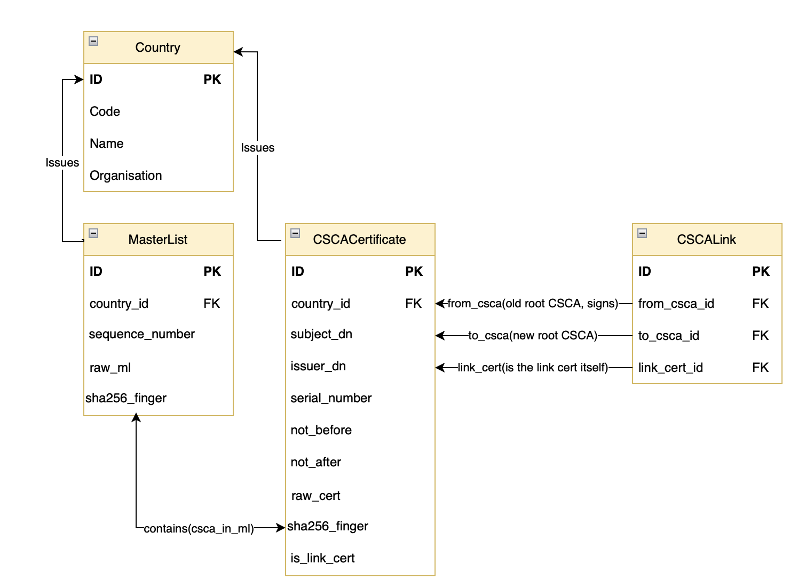
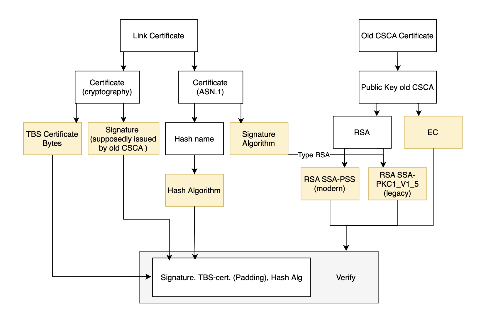
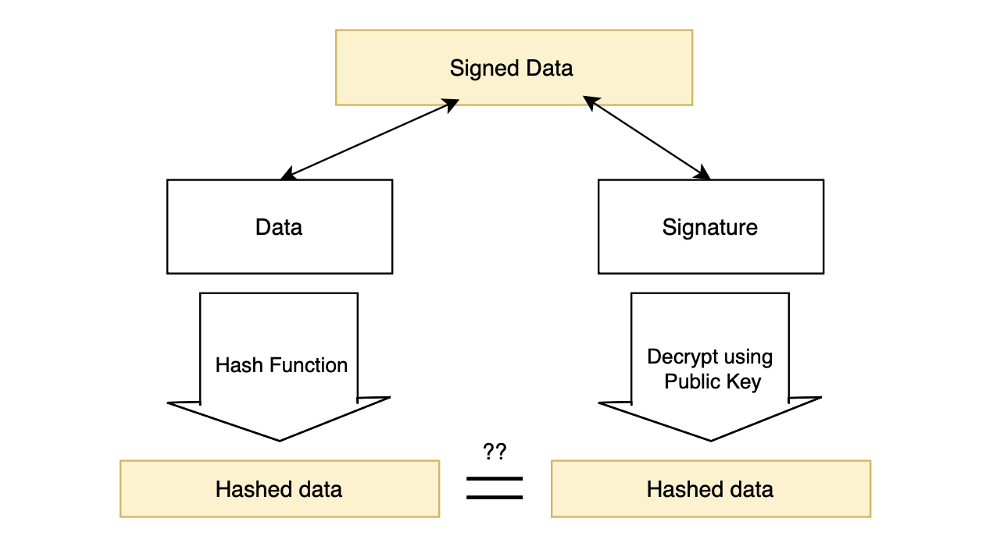

# eMRTD CSCAs from public MLs

Imports and validates eMRTD PKI data — CSCA and Link certificates from public master lists — into a relational
database for cross-referencing and trust-chain validation.

## Requirements

- Python 3.11+
- `cryptography==46.0.0` (pinned — see [Known Issues](#known-issues--data-quirks))
- `asn1crypto`
- OpenSSL CLI available on `PATH` (used as a fallback for explicit-curve EC keys)
- PostgreSQL

## Setup

```bash
pip install -r requirements.txt
```

Set the database connection string in `.env`:

I personally used sqlite for simplicity.
```
DB_URL=sqlite:///data/passport_pki.db
```

## Country scope

Master lists are currently downloaded and imported for:

| Country | Code |
|---|---|
| Netherlands | NL |
| Italy | IT |
| Germany | DE |

## Running the importer

This downloads the MLs from public websites.
Please first verify links before running the program to ensure safety.
- The Dutch National Public Key Directory , www.npkd.nl
- BSI Nundesamt für Sicherheit in der Informationstechnik, www.bsi.bund.de
- Ministero dell'Interno, www.csca-ita.interno.gov.it

All links are found in: 

```bash
PKD/load_ml.py
```

```bash
python -m PKD.PKDimporter
```

## Database structure

Core tables: `Country`, `MasterList`, `CSCACertificate`, `CSCALink`. 
Join table: `csca_in_ml` many-to-many between master list and CSCA certs.

`CSCALink` is an edge connecting two CSCA certificates with a Link certificate. 



## Link certificate validation

A link certificate's `AuthorityKeyIdentifier` (AKI) and `SubjectKeyIdentifier`
(SKI) extensions are used to locate its claimed predecessor (old CSCA) and
successor (new CSCA) within the existing CSCA set. 

According to `Doc 9303 Part 12` Table 6 on page 41, SKI and AKI are mandatory extensions.

- The CSCA Certificate is self-signed meaning SKI == AKI.
- The Link Certificate is signed by the old CSCA and the new CSCA is the subject. This means AKI = old CSCA , SKI = new CSCA.

The full process of linking certificates:

1. Build a `SKI -> CSCACertificate` lookup map from **all** stored CSCA certs.
2. For each link cert, resolve `AKI -> old CSCA` and `SKI -> new CSCA` via
   that map.
3. **AKI/SKI matching alone is not proof of issuance** — it only identifies a
   *candidate* issuer. The actual cryptographic signature is verified against
   the candidate's public key in (`_verify_link`) before the link is trusted,
   since matching identifiers can't be forged-checked without doing the math.

As older certificates exist and countries vary from format, there exist different formats. 
Signature verification handles RSA (PKCS#1 v1.5 and RSASSA-PSS) and ECDSA,
with the hash algorithm and PSS parameters read via `asn1crypto` rather than
`cryptography`'s `signature_hash_algorithm`, which does not resolve PSS.


Data flow of validation.


Validation abstracted.


## Known issues and data quirks

Real-world ICAO PKD data is not uniformly spec-conformant. Confirmed cases
encountered so far:

- **Explicit EC curve parameters** — some CSCA/DSC certs encode EC public
  keys with explicit curve parameters instead of a named curve OID, which
  `cryptography` refuses to load. Worked around via an OpenSSL subprocess
  re-encode.
- **Missing AKI and SKI extension** — Doc 9303 Part 12 marks AKI and SKI as mandatory on
  link certs, but some national CSCAs omit it.
- **Unresolved issuers** — a number of link certs (LV, CY, AE, LB, AT, HU,
  BG, TR, EE, PH, MD, CN, MA as of writing) have no matching predecessor CSCA
  in the imported dataset. Likely cause: ICAO PKD master lists may not
  republish CSCA certs once fully superseded, even though the link cert
  referencing them remains published. Most of the time, a second link cert exists from the same date.
- **Malformed extensions** — at least two Lithuanian certs raise a parse
  error on a specific extension; root cause not yet isolated.
- **Non-conformant ASN.1 encodings** — NULL signature algorithm parameters
  (common in Java-generated certs) and non-positive serial numbers. Currently
  only warnings in `cryptography==46.0.0`; a future release will treat these
  as hard parse failures, which is why the version is pinned rather than
  left floating. The program will fail for the most recent versions of cryptography. 
