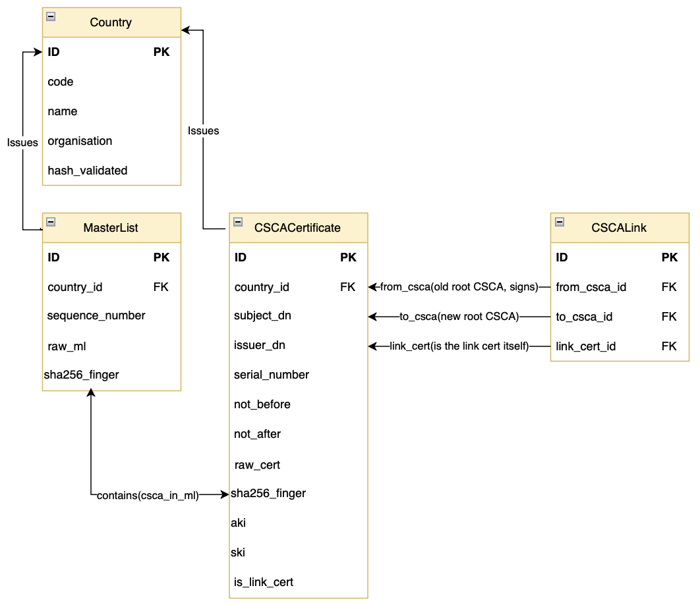
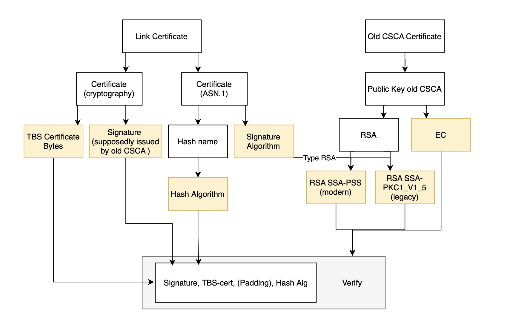
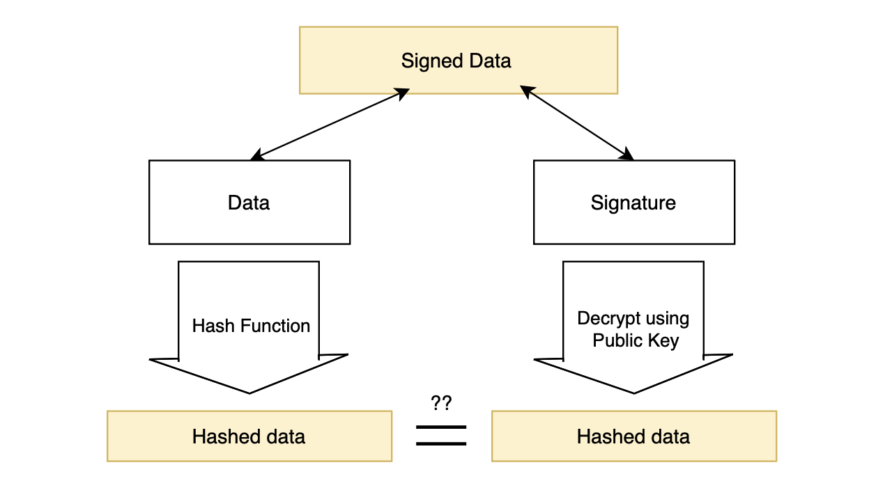

# PKD from public MLs

Imports and validates eMRTD PKI data — CSCA and Link certificates from public master lists — into a relational
database for cross-referencing and trust-chain validation.

## Requirements

- Python 3.11+
- `cryptography==46.0.0` (pinned — see [Known Issues](#known-issues--data-quirks))
- `asn1crypto`
- OpenSSL CLI available on `PATH` (used as a fallback for explicit-curve EC keys)
- PostgreSQL

## Setup

```bash
pip install -r requirements.txt
```

Set the database connection string in `.env`:

I personally used sqlite for simplicity.
```
DB_URL=sqlite:///data/passport_pki.db
```

## Country scope

Master lists are currently downloaded and imported for:

| Country | Code |
|---|---|
| Netherlands | NL |
| Italy | IT |
| Germany | DE |
| Sweden | SE |

## Running the importer

This downloads the MLs from public websites.
Please first verify links before running the program to ensure safety.
- [The Dutch National Public Key Directory](https://www.npkd.nl)
- [BSI Nundesamt für Sicherheit in der Informationstechnik](https://www.bsi.bund.de)
- [Ministero dell'Interno](https://www.csca-ita.interno.gov.it)
- [Polisen Sverige](http://cert.polisen.se)

All links are found in: 

```bash
PKD/load/mls.py
```

```bash
python -m PKD.PKDimporter
```

## Database structure

Core tables: `Country`, `MasterList`, `CSCACertificate`, `CSCALink`. 
Join table: `csca_in_ml` many-to-many between master list and CSCA certs.

`CSCALink` is an edge connecting two CSCA certificates with a Link certificate. 



## Certificate validation

A certificate's `AuthorityKeyIdentifier` (AKI) and `SubjectKeyIdentifier`
(SKI) extensions are used to locate its claimed predecessor (old CSCA) and
successor (new CSCA) within the existing CSCA set. 

According to `Doc 9303 Part 12` Table 6 on page 41, SKI and AKI are mandatory extensions.

- The CSCA Certificate is self-signed meaning SKI == AKI.
- The Link Certificate is signed by the old CSCA and the new CSCA is the subject. This means AKI = old CSCA , SKI = new CSCA.

The full process of linking certificates:

1. Build a `SKI -> CSCACertificate` lookup map from **all** stored CSCA certs.
2. For each link cert, resolve `AKI -> old CSCA` and `SKI -> new CSCA` via
   that map.
3. **AKI/SKI matching alone is not proof of issuance** — it only identifies a
   *candidate* issuer. The actual cryptographic signature is verified against
   the candidate's public key in (`_verify_link`) before the link is trusted,
   since matching identifiers can't be forged-checked without doing the math.

As older certificates exist and countries vary from format, there exist different formats. 
Signature verification handles RSA (PKCS#1 v1.5 and RSASSA-PSS) and ECDSA,
with the hash algorithm and PSS parameters read via `asn1crypto` rather than
`cryptography`'s `signature_hash_algorithm`, which does not resolve PSS.


Data flow of validation.


Validation for RSA abstracted.

## Get CRL from certificate

The `CRL` folder holds functions that identify and gather CRL distribution points based on a certificate. 

`get_crl_urls` builds the list of candidate URLs for a given CSCA certificate. It checks the certificate's `CRLDistributionPoints` extension, as some issuers publish a pointer to the CRL infrastructure they use (either self-hosted or from the ICAO PKD). Where no explicit point exists, or in addition to it, a predictable ICAO PKD URL is generated with the three-letter country code in `build_URL`. This is of the format `https://pkddownload1.icao.int/CRLs/CountryCode.crl` and `https://pkddownload2.icao.int/CRLs/CountryCode.crl`.

Once all known URLs are retrieved, we try the URLs in `fetch_crl` which returns the first one that resolves a valid CRL. Both HTTP(S) and LDAP are supported. For HTTP(S), it is checked for a leading `0x30` byte to confirm it is a DER-encoded CRL instead of an error page and LDAP, queried via `ldap3` against the `certificateRevocationList` attribute (or whichever attribute is specified in the URL's query string).

`GetCRL.get_crl` ties the two together and adds signature verification. By inputting a certificate, it resolves the URLs, fetch a CRL and then verifies the signature against a ranked list of CSCA certificates for the issuing country — not just the CSCA that signed the DS certificate being checked, since a CRL may have been issued after a key rollover. Validation is again done using the function in `PKD/verify`, just like for Link certificates. If no valid CRLs are found, `None` is returned.

## Trust Score of a Root Certificate

According to official ICAO documentation, there exist three categories for ranking the trust of CSCA certificates. As the CSCA serves as the root anchor of the entire validation process, establishing its trust is critical for ePassport validation.

The scoring logic can be found in:
```bash
PKD/graph/score_builder.py
```

The score stored in the database is an integer value from 0–3, corresponding to the official ICAO categories:

| Score | Rating |
|---|---|
| 0     | Red    |
| 1     | Amber  |
| 2–3   | Green  |

[Full explanations of these categories can be found on the ICAO website](https://www.icao.int/icao-pkd/epassport-validation-roadmap-tool-validating-csca).

A CSCA root gains one trust point for each of the following, independently satisfied:
- At least one Master List containing this CSCA was verified against its published thumbprint.
- The CSCA certificate appears in more than one independent Master List.
- The CSCA certificate has at least one verified link certificate chaining to it.

This is not a complete implementation of ICAO's methodology: ICAO's own criteria also include direct bilateral exchange with a trusted contact at the issuing authority, which this implementation cannot replicate.

## Known issues and data quirks

Real-world ICAO PKD data is not uniformly spec-conformant. Confirmed cases
encountered so far:

- **Explicit EC curve parameters** — some CSCA/DSC certs encode EC public
  keys with explicit curve parameters instead of a named curve OID, which
  `cryptography` refuses to load. Worked around via an OpenSSL subprocess
  re-encode.
- **Missing AKI and SKI extension** — Doc 9303 Part 12 marks AKI and SKI as mandatory on
  link certs, but some national CSCAs omit it.
- **Unresolved issuers** — a number of link certs (LV, CY, AE, LB, AT, HU,
  BG, TR, EE, PH, MD, CN, MA as of writing) have no matching predecessor CSCA
  in the imported dataset. Most of the time, a second link cert exists from the same date.
- **Malformed extensions** — at least two Lithuanian certs raise a parse
  error on a specific extension; root cause not yet isolated.
- **Non-conformant ASN.1 encodings** — NULL signature algorithm parameters
  (common in Java-generated certs) and non-positive serial numbers. Currently
  only warnings in `cryptography==46.0.0`; a future release will treat these
  as hard parse failures, which is why the version is pinned rather than
  left floating. The program will fail for the most recent versions of cryptography 
  and the warning in version 46.0.0 is surpressed.
- **Chicken-and-egg problem for Master List trust** — Verifying a Master List's signature requires 
  already possessing the CSCA root certificate that signed it. However, the most convenient source of 
  that CSCA root is the Master List itself, creating a circular trust dependency: an automated pipeline 
  cannot bootstrap trust in the root it needs from the very document that root is meant to authenticate. 
  Verifying a Master List's signature against a CSCA certificate bundled inside that same Master List 
  would provide no real security, since a forged Master List could simply include a matching forged CSCA 
  root, passing its own internal signature check.

