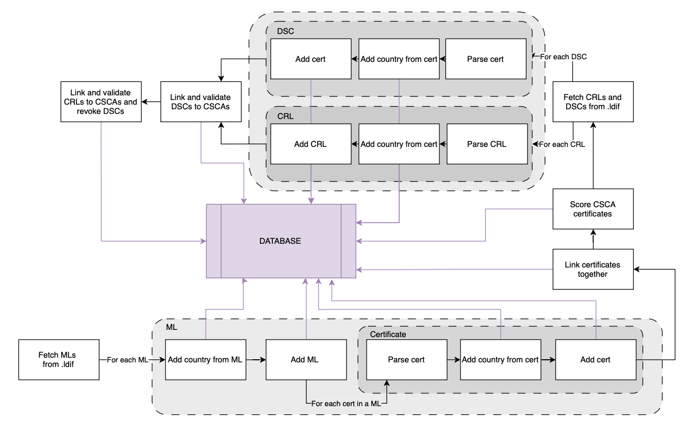
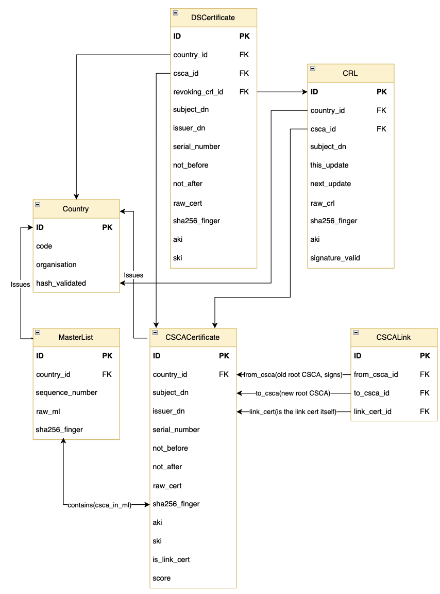
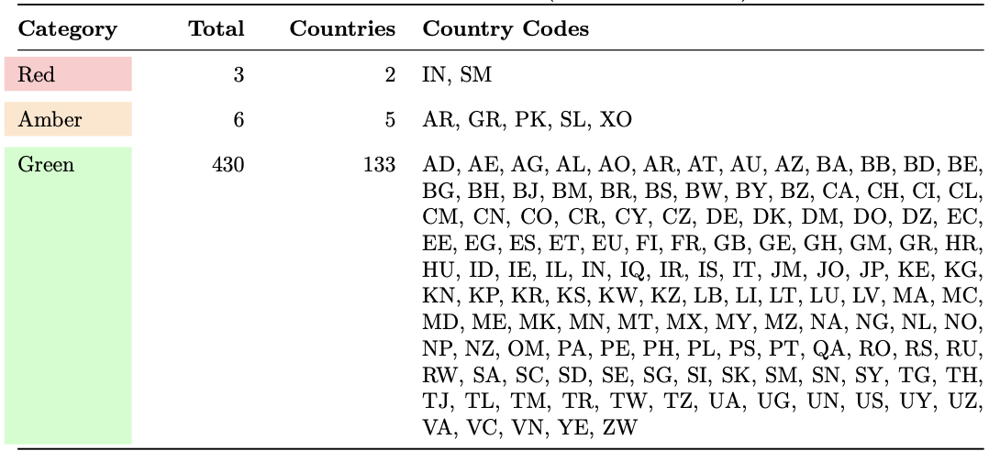

# PKD from ICAO - .ldif files

Imports and validates eMRTD PKI data — CSCA, DSC and Link certificates and CRLs from ICAO .ldif files — into a relational
database for cross-referencing and trust-chain validation. **Only allowed to use for testing and exploration, not commercial use**

Abstract overview of main import file: `PKD/PKDimporter.py`


## Requirements

- Python 3.11+
- `cryptography==46.0.0` (pinned — see [Known Issues](#known-issues--data-quirks))
- `asn1crypto`
- OpenSSL CLI available on `PATH` (used as a fallback for explicit-curve EC keys)
- PostgreSQL
- ldif for LDIFParser

## Setup & running the importer

```bash
pip install -r requirements.txt
```

Set the database connection string in `.env`. For development and testing I used SQLite, 
but for actual use Postgres is the target.
```
DB_URL = sqlite:///data/passport_pki.db
```
Besides that, also set the paths to the files you will be parsing. So one to the ICAO PKD file for MLs and one for the other PKI objects.
```
ICAOPKD_ML_PATH = 'some url'
ICAOPKD_CRL_DS_PATH = 'some url'
```

Importer can be run by:

```bash
python -m PKD.PKDimporter
```


## Country scope

Master lists currently included in the ICAO PKD:

| Country | Code |
|---|---|
| Angola | AO |
| Canada | CA |
| Switzerland | CH | 
| Germany | DE |
| Spain | ES |
| France | FR |
| Hungary | HU |
| India | IN |
| Italy | IT |
| Netherlands | NL |
| Romania | RO |
| Sweden | SE |
| United Nations | UN |

Besides these, also the following countries who only share their own country CSCA:
| Country | Code |
|---|---|
| Austria | AT |
| Bangladesh | BD |
| Botswana | BW |
| Cameroon | CM |
| Croatia | CR |
| Ecuador | EC |
| Finland | FI |
| Latvia | LV |
| Moldova | MD |
| Mongolia | MN |
| Norway | NO |
| Seychelles| SC |
| Ukraine | UA | 
| Uganda | UG |
| Uzbekistan | UZ |


## Database structure

Core tables: `Country`, `MasterList`, `CSCACertificate`, `CSCALink`.
Join table: `csca_in_ml` many-to-many between master list and CSCA certs.
Extended tables: `CRL`, `DSCertificate`.

`CSCALink` is an edge connecting two CSCA certificates with a Link certificate. 



## Link Certificate validation

A certificate's `AuthorityKeyIdentifier` (AKI) and `SubjectKeyIdentifier`
(SKI) extensions are used to locate its claimed predecessor (old CSCA) and
successor (new CSCA) within the existing CSCA set. 

According to `Doc 9303 Part 12` Table 6 on page 41, SKI and AKI are mandatory extensions.

- The CSCA Certificate is self-signed meaning SKI == AKI.
- The Link Certificate is signed by the old CSCA and the new CSCA is the subject. This means AKI = old CSCA , SKI = new CSCA.

The full process of linking certificates:

1. Build a `SKI -> CSCACertificate` lookup map from **all** stored CSCA certs.
2. For each link cert, resolve `AKI -> old CSCA` and `SKI -> new CSCA` via
   that map.
3. **AKI/SKI matching alone is not proof of issuance** — it only identifies a
   *candidate* issuer. The actual cryptographic signature is verified against
   the candidate's public key in (`_verify_link`) before the link is trusted,
   since matching identifiers can't be forged-checked without doing the math.

As older certificates exist and countries vary from format, there exist different formats. 
Signature verification handles RSA (PKCS#1 v1.5 and RSASSA-PSS) and ECDSA,
with the hash algorithm and PSS parameters read via `asn1crypto` rather than
`cryptography`'s `signature_hash_algorithm`, which does not resolve PSS.


Data flow of validation.


Validation for RSA abstracted.

## Trust Score of a Root Certificate

According to official ICAO documentation, there exist **three** categories for ranking the trust of CSCA certificates. As the CSCA serves as the root anchor of the entire validation process, establishing its trust is critical for ePassport validation.

The scoring logic of this file is slightly altered.

The scoring logic can be found in:
```bash
PKD/graph/score_builder.py
```

The score stored in the database is an integer value from 0–3, corresponding to the official ICAO categories:

| Score | Rating |
|---|---|
| 0     | Red    |
| 1     | Amber  |
| 2–4   | Green  |

[Full explanations of these categories can be found on the ICAO website](https://www.icao.int/icao-pkd/epassport-validation-roadmap-tool-validating-csca).

A CSCA root gains one trust point for each of the following, independently satisfied:
- The CSCA certificate appears in more than one independent Master List.
- The CSCA certificate appears in more than five independent Master List.
- The CSCA certificate has at least one verified link certificate chaining to it.
- The CSCA certificate verifies more than two Document Signer certificates.

This is not a complete implementation of ICAO's methodology: ICAO's own criteria also include direct bilateral exchange with a trusted contact at the issuing authority, which this implementation cannot replicate.


## Known issues and data quirks

Real-world ICAO PKD data is not uniformly spec-conformant. Confirmed cases
encountered so far:

- **Explicit EC curve parameters** — some CSCA/DSC certs encode EC public
  keys with explicit curve parameters instead of a named curve OID, which
  `cryptography` refuses to load. Worked around via an OpenSSL subprocess
  re-encode.
- **Missing AKI and SKI extension** — Doc 9303 Part 12 marks AKI and SKI as mandatory on
  link certs, but some national CSCAs omit it.
- **Unresolved issuers** — a number of link certs (LV, CY, AE, LB, AT, HU,
  BG, TR, EE, PH, MD, CN, MA as of writing) have no matching predecessor CSCA
  in the imported dataset. Most of the time, a second link cert exists from the same date.
- **Malformed extensions** — at least two Lithuanian certs raise a parse
  error on a specific extension; root cause not yet isolated.
- **Non-conformant ASN.1 encodings** — NULL signature algorithm parameters
  (common in Java-generated certs) and non-positive serial numbers. Currently
  only warnings in `cryptography==46.0.0`; a future release will treat these
  as hard parse failures, which is why the version is pinned rather than
  left floating. The program will fail for the most recent versions of cryptography 
  and the warning in version 46.0.0 is surpressed.
- **Chicken-and-egg problem for Master List trust** — Verifying a Master List's signature requires 
  already possessing the CSCA root certificate that signed it. However, the most convenient source of 
  that CSCA root is the Master List itself, creating a circular trust dependency: an automated pipeline 
  cannot bootstrap trust in the root it needs from the very document that root is meant to authenticate. 
  Verifying a Master List's signature against a CSCA certificate bundled inside that same Master List 
  would provide no real security, since a forged Master List could simply include a matching forged CSCA 
  root, passing its own internal signature check.

## Tests

Most of the tests are inspection scripts for the data, not assertions.
Test files used : `icaopkd_001_complete_10203.ldif` and `icaopkd_002_complete_525.ldif`

### Signature test (pytest) `signature_test.py`
- Covers if the cryptographic verification logic itself is implemented correctly: RSA and EC signatures 
  verify and fail correctly and unsupported key types and hash algorithms are rejected. 
- AKI and SKI extraction is done correctly and models teh actual trust-chain relationships
  (so self-signed means AKI == SKI, and for DS certificates own AKI != CSCA SKI).
- The explicit EC curve parameters fallback is proven end-to-end: extraction succeds, 
  the curve resolves correctly and the extracted key verifies the real signature.

`python -m pytest tests/signature_test.py -v`

### Country Coverage `signature_test.py`
Each country is covered using the ICAO PKD. 13 MLs are shared where there exist more CSCAs than just its own country.
198 out of 895 of all CSCA certificates are expired. 

### CRL Distribution points  `crldistr_test.py`
Loops through all CRLs and check which serial numbers are found.

Results expected : 75 CRLs in total, whereof 51 are empty and 24 non-empty.
It covers 71 countries, some countries have two CRLs where usually one is empty.

### Fingerprint irregularities `fingerprint_test.py`
Prints inconsistencies of certificates. Checks if each sha256 fingerprint maps to exactly one row 
(so if each fingerprint is unique) and if all countries MLs publishes the same and unqiue fingerprint 
for the same entry (country, org, not_after).

Results expected : no sha256 fingerprints seem to be duplicated.
Moreover, in some cases the same entry maps to multiple fingerprints. An example of this is: 

  GR/Hellenic Republic/2026-11-07 21:59:59: 
  {'AO': {'ef056a5985c1df49e2f2a0f578338f4c1e3dd12230422135a99a79cdb5c4c49f', '2922eeea18556c36b0208496874fb4fe003007c94fa76eca7e1819a626daae0b'}, 
  'DE': {'2922eeea18556c36b0208496874fb4fe003007c94fa76eca7e1819a626daae0b'}, 
  'HU': {'2922eeea18556c36b0208496874fb4fe003007c94fa76eca7e1819a626daae0b'}, 
  'IN': {'ef056a5985c1df49e2f2a0f578338f4c1e3dd12230422135a99a79cdb5c4c49f', '2922eeea18556c36b0208496874fb4fe003007c94fa76eca7e1819a626daae0b'}, 
  'IT': {'ef056a5985c1df49e2f2a0f578338f4c1e3dd12230422135a99a79cdb5c4c49f', '2922eeea18556c36b0208496874fb4fe003007c94fa76eca7e1819a626daae0b'}, 
  'SE': {'ef056a5985c1df49e2f2a0f578338f4c1e3dd12230422135a99a79cdb5c4c49f', '2922eeea18556c36b0208496874fb4fe003007c94fa76eca7e1819a626daae0b'}}

In every case observed so far, the same second fingerprint (`ef056a59...` here) appears in the AO, IN, IT and SE MLs,
and both always agree with the other fingerprints. This is not caused by link certificates, which are filtered
out separately before this check runs. 

When further investigated the aki and ski, it seemed to have two different keypairs, but with the same signature algorithms. 
It seems that Greece has two legitimate CSCA certificates that some MLs do not trust or are not aware of.
 
### Link Chain for a country `link_chain_test.py`
This shows which link certificates exist for each CSCA root certificate for a specific country.
It shows the validity period, in which MLs the certificate exists, the hash, organization, ID and then
the outgoing links with the hash of which next certificate is point to together with the link certificate hash
and for the incoming links with the hash of which certificate points to it and the link certificate hash.

This makes you able to investigate a link chain of a country. Sometimes certificates are isolated, this could be due
to a country not issueing link certificates or a root certificate is too old to have it implemented.

### Score CSCA root `score_test.py`
This prints the scores of all root certificates in the datebase.
Results expected : 

AM, KP, MV, MZ, NG, PK, PY and SL appear in more than one category, indicating multiple CSCA certificates per
country code with differing trust scores.

### DS Certificate `dsc_test.py`
This prints the revoked DS Certificate number with the corresponding country and CRL.
Results expected : only one DS certificates who were in the .ldif file are revoked.
Two are printed, DS certificate for AO with CSCA 71 in CRL 20. These certifacetes have different fingerprints.
